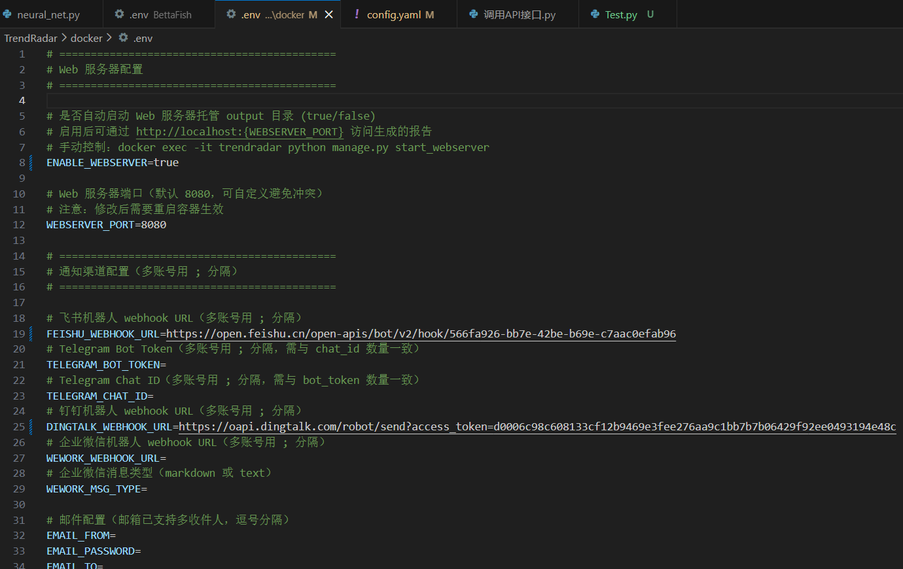
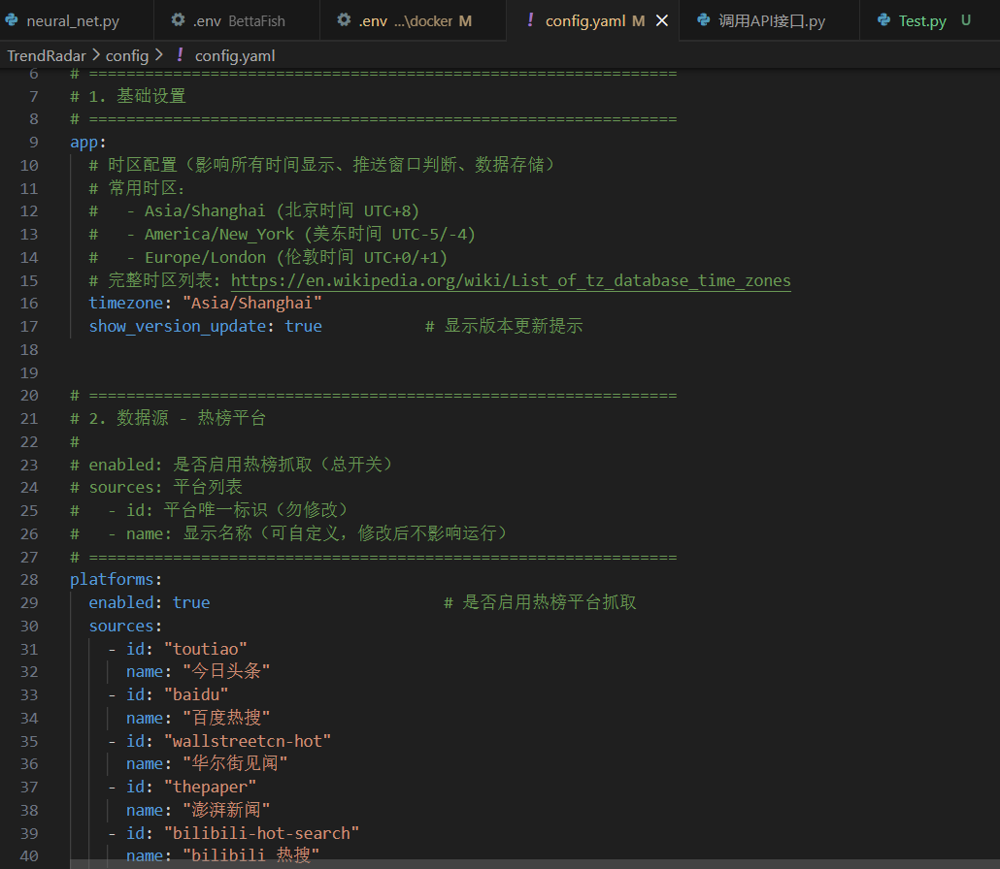
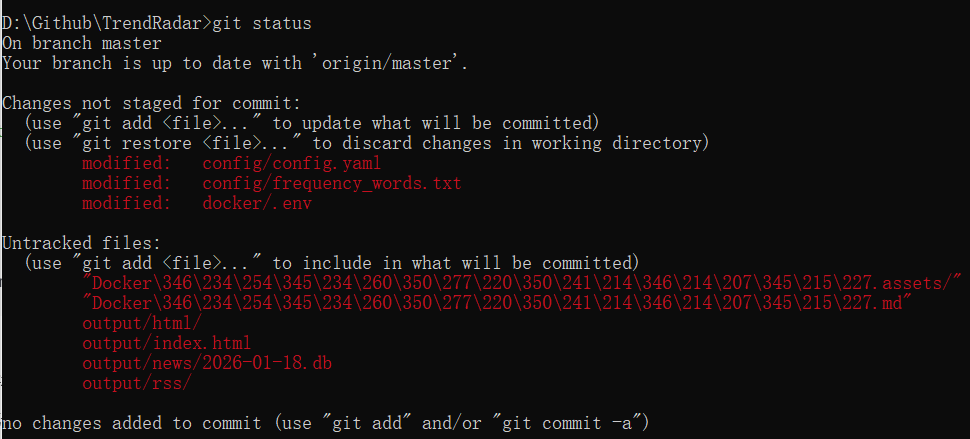
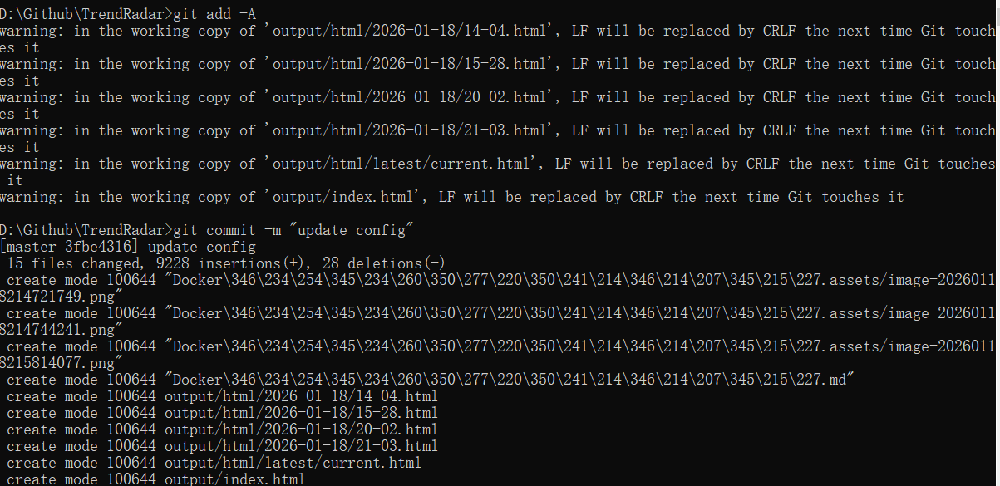
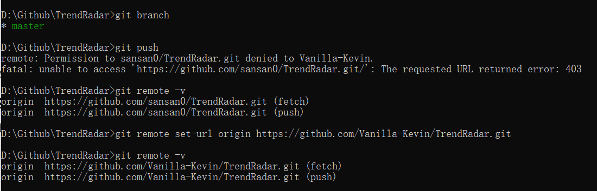

[TOC]

# 一键让项目在电脑本地Docker跑起来

在电脑`cmd`或`Power Shell`命令窗口里均能跑起来，这里推荐`cmd`窗口。

命令大全看这里：-->> [Docker 命令大全 | 菜鸟教程](https://www.runoob.com/docker/docker-command-manual.html)

这里为了简便起见，只给出如何运行该项目。

```bash
docker --version
docker compose version
以上命令是为了确认 docker 已安装并能被系统识别
```

```bash
先 git clone https://github.com/sansan0/TrendRadar.git
cd TrendRadar   到该项目的根目录下
```

TrendRadar 的 docker-compose 默认会把：

- `../config` 挂载到容器 `/app/config:ro`
- `../output` 挂载到容器 `/app/output`
   并且 Web 端口默认绑定 `127.0.0.1:${WEBSERVER_PORT}`（本机访问）

## （可选）不用 git：PowerShell 直接下载模板（替代 wget）

> 你贴的 wget 在 Windows 未必有；PowerShell 用 `Invoke-WebRequest` 更稳。

```powershell
mkdir trendradar, trendradar\config, trendradar\docker | Out-Null
cd trendradar

# 配置文件
iwr https://raw.githubusercontent.com/sansan0/TrendRadar/master/config/config.yaml -OutFile config\config.yaml
iwr https://raw.githubusercontent.com/sansan0/TrendRadar/master/config/frequency_words.txt -OutFile config\frequency_words.txt
iwr https://raw.githubusercontent.com/sansan0/TrendRadar/master/config/ai_analysis_prompt.txt -OutFile config\ai_analysis_prompt.txt

# Docker 文件
iwr https://raw.githubusercontent.com/sansan0/TrendRadar/master/docker/.env -OutFile docker\.env
iwr https://raw.githubusercontent.com/sansan0/TrendRadar/master/docker/docker-compose.yml -OutFile docker\docker-compose.yml

mkdir output | Out-Null
```

一般来说，项目部署在本地，想要跑起来还需要根据自己的行为习惯微调。

在此项目背景下，需要微调的是 `.\docker\.env` 文件与 `.\config\config.yaml` 文件，如下图：





`config.yaml` 中有 `app.timezone`，默认是 `Asia/Shanghai`。其他（平台、RSS、报告模式等）可以先不动，先跑通再调。

## 启动`TrendRadar`

进入 `docker` 目录启动（因为 compose 里用相对路径挂载 `../config` 和 `../output`）

```bash
cd docker
docker compose pull trendradar
docker compose up -d trendradar
```

想要验证容器是否真的跑起来了，运行如下代码：

```bash
docker ps
docker ps -a 		-->> 看docker内所有的镜像
docker ps -n 2		-->> 看docker内最近添加的两个镜像
```

如果还不放心，那么最直接的便是直接看日志，这是**最可靠**的做法。

```bash
docker logs -f trendradar
```

正常情况下你会看到类似这些关键日志（示例中包含）：

- `配置文件加载成功: /app/config/config.yaml`
- `开始爬取数据...`
   这些日志格式在项目 issue 的真实输出里可见。

> 如果日志里出现 `Network is unreachable` 这类错误，说明**容器没法联网**（或你当前网络/代理导致访问失败）。

## 看 output 是否生成文件

打开你本地 `TrendRadar/output/`（或你创建的 `trendradar/output/`），应逐步出现生成的报告/数据库等文件，因为它被挂载到容器 `/app/output`

## 用浏览器打开 Web 页面（你已在 .env 开启 WebServer 时）

访问：

- `http://localhost:8080`

端口映射在 docker-compose 中绑定到 `127.0.0.1:${WEBSERVER_PORT}`，并由 `.env` 控制 `WEBSERVER_PORT`

## （可选）启动 MCP AI 分析服务（需要才启）

`TrendRadar` 的 `compose` 还包含 `trendradar-mcp`，默认端口 `127.0.0.1:3333:3333`，并共享同一份 `config` 与 `output` 挂载。

启动：

```bash
cd docker
docker compose pull trendradar-mcp
docker compose up -d trendradar-mcp
```

看日志：

```bash
docker logs -f trendradar-mcp
```

## 后续常用维护命令

**重启使配置生效**（官方指南也强调了这一点；改完配置重启容器即可）

```bash
cd docker
docker compose up -d
```

**停止指定服务**

```bash
docker compose stop trendradar
docker compose stop trendradar-mcp
```

**更新镜像**

```bash
docker compose pull
docker compose up -d
```

## 桌面端 Docker 运行的现实约束（你之前问过的点，放这里说清）

- 如果你把 Docker 部署在**你自己的桌面电脑**上：
   **电脑必须开机**，并且通常需要联网才能抓取数据/推送（断网会在日志里看到网络失败）。
- 如果你想“电脑关机也照跑”：应把 Docker 跑在 **NAS/小主机/VPS** 这种常开设备上，或改用 **GitHub Actions**（但 Actions 有它自己的限制/续期机制，你之前也提到过）。

## 最常见失败点（按出现频率排序）

1. **端口 8080 被占用**

- 改 `docker/.env`：`WEBSERVER_PORT=18080`，然后：

```
cd docker
docker compose up -d
```

2. **日志显示 Network is unreachable / 请求失败**

- 说明容器网络出不去或访问源受限；日志里会清楚写出来。
- 先确认：你的电脑能正常上网、Docker Desktop 正常、没有把 Docker 网络代理配错。

3. **output 目录没生成任何东西**

- 确认你是否创建了根目录 `output`，以及你是否从 `docker/` 目录启动（因为 compose 用 `../output` 挂载）。
- 再看 `docker logs -f trendradar`，看是否实际执行了爬取（有无“开始爬取数据”）。


-------------------------------------------------------------------答疑解惑区-------------------------------------------------------------

**远程存储（S3_\*）是干嘛的？桌面端要配吗？**

- 这是把数据存到 **S3 兼容对象存储**（R2/OSS/COS/S3/MinIO）的配置。
- `storage.backend=auto` 的逻辑是：**GitHub Actions 且配了远程存储 → 用 remote，否则 → 用 local**。
- 你桌面 Docker 跑，**不需要配**，留空即可；数据默认就落在本地 `./output`（sqlite/html 等）。

**为什么 Docker Desktop 的 Volumes 里看不到东西？**

因为 TrendRadar compose 用的是 **宿主机目录挂载（bind mount）**：
 `../config:/app/config`、`../output:/app/output`，不是“命名 volume”。
 所以 Docker Desktop “Volumes” 页面可能为空，但数据实际在你本地项目目录的 `output/` 里（README 也写了默认保存在 `./output`）。

## 云端运行的原理（本质）

1. 到点触发（schedule/手动触发/推送触发等）。
2. GitHub 分配一台临时的 **Runner 虚拟机**（云端机器）。
3. Runner **拉取（checkout）你仓库某个提交的代码**（通常是默认分支最新 commit）。
4. 按 workflow 文件里的步骤：装依赖、跑脚本、生成报告/推送消息。
5. 任务结束后，这台 Runner 通常是**一次性的**：机器环境会被回收。
   - 想“跨次运行保存东西”，只能靠：**Artifacts / Cache / 外部存储**（比如对象存储、数据库、网盘等），或者把结果 commit 回仓库（不推荐频繁写仓库）。


## **改动本地代码并push到云端服务器**

**最直接方案（你改动在本地，推到默认分支）**

在项目根目录执行：

```bash
git status
git add -A
git commit -m "update config"

git branch
git branch -M main   # 如果你的默认分支是 main；若是 master 就改成 master

git push -u origin main
```

说明：

- `git add -A`：把所有改动加入暂存区
- `git commit`：生成一次提交
- `git push`：推到 GitHub（触发/影响 Actions）

**如果你本地不在默认分支（比如在 feature 分支）**

```bash
git checkout main
git pull
git merge feature-branch
git push
```

**第一次 push 提示要登录/权限**

- 按提示在浏览器登录 GitHub；或用 Personal Access Token 作为密码。

结论：GitHub Desktop 非必需，命令行最快。







遇见问题：`git push` 后会默认推到作者仓库。是因为你本地仓库的 **remote `origin` 指向了 `https://github.com/sansan0/TrendRadar.git`**（也就是你 clone 时的来源）。你对作者仓库没写权限，所以 403 是正常的（没有权限）。

1) 先确认你现在的 origin 指到哪里

在项目根目录执行：

```bash
git remote -v
```

如果看到 `origin  https://github.com/sansan0/TrendRadar.git`，那就解释了为什么 push 去作者仓库。

2) 把 origin 改成你自己的 fork（推荐做法）

把 `<YOUR_GH>` 换成你的 GitHub 用户名：

```bash
git remote set-url origin https://github.com/Vanilla-Kevin/TrendRadar.git
```

可选：把作者仓库加成 `upstream`（以后用来同步更新）

```bash
git remote add upstream https://github.com/sansan0/TrendRadar.git
```

3) `git push -u origin main` 是什么意思

- `origin`：远端名（默认远端的别名）
- `main`：你要推送的本地分支名
- `-u`：设置“上游/跟踪分支”（upstream tracking），以后你在这个分支上直接 `git push`/`git pull` 就会默认对着 `origin/main`。

4) 你现在本地分支是 master，怎么推到 fork？

你现在 `git branch` 显示是 `master`。有三种做法，选一个：

方案 A：fork 也是 master（最简单）

```bash
git push -u origin master
```

方案 B：fork 默认分支是 main（推荐统一成 main

```bash
git branch -M main
git push -u origin main
```

方案 C：本地保留 master，但推到远端 main

```bash
git push -u origin master:main
```

5) 你改了很多文件：要不要一个文件一个 commit？

不需要。原则是：**一次 commit 可以包含多个文件**（只要它们属于同一批逻辑改动）。
 关键点：`git push` **只会上传已 commit 的提交**，不会上传你工作区里未提交的修改。

最常用的一次性流程：

```bash
git status
git add -A
git commit -m "update TrendRadar config"
git push   # 如果前面用了 -u 设置过上游，这里就够了
```
